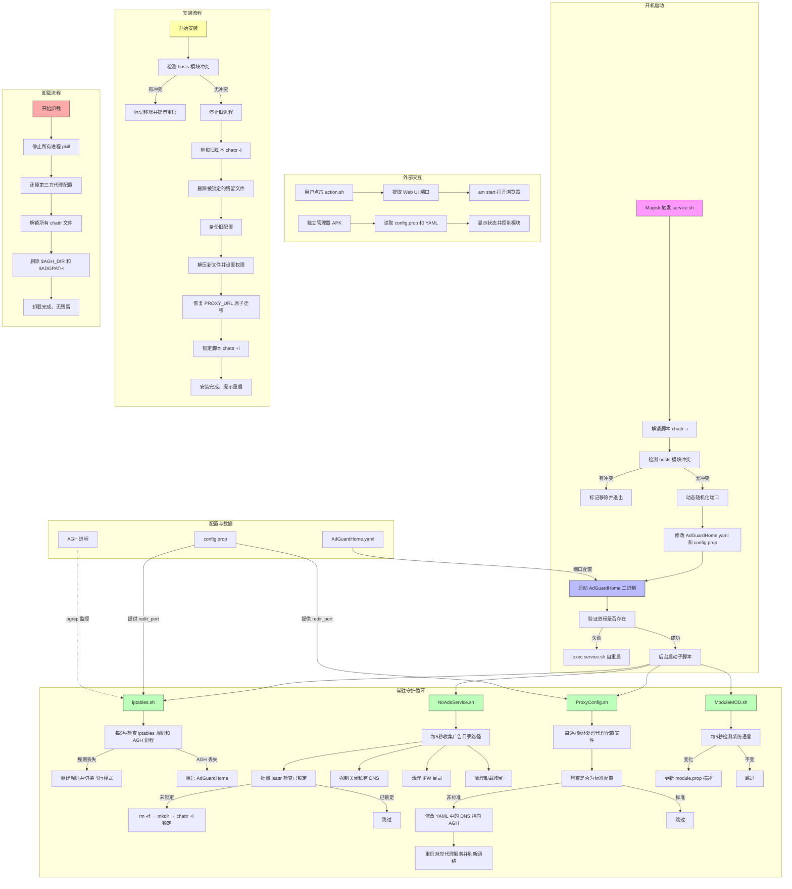

# Adguard Home For Android

 **简体中文** | [English](README.en.md)
- 通过重定向过滤DNS请求屏蔽广告且带有模块系统的Root管理器通用
- 本项目永久开源免费无捐赠及其变种，不以是否捐赠来区分版本
- 达到了开箱即用的易用性、操作失误自动恢复，刷入模块后按照教程稍微排查一下即可使用（无需配置规则）
- 内置了GOODBYEADS的拦截规则并在此基础上增加了自定义规则
- 改包与Hosts共存或者去掉其他限制造成的问题别来找我（因为都是为了确保模块能够正常运行所设下的限制，去掉限制代表你能够自行解决问题那不要来找我）
- 本项目旨在取代传统Hosts以带来更好的现代化体验——“零”广告侧漏、高性能、强隐蔽性
- 已经兼容了Surfing、Box、AkashaProxy、Clash MIX代理模块，其余的暂不兼容
- 不看教程不要来找我反馈，点此链接直接跳转到教程：[点击跳转](https://github.com/liuzq2002/Adguard-Home-For-Magisk-Mod/tree/main?tab=readme-ov-file#-%E6%95%99%E7%A8%8B%E4%B8%8D%E7%9C%8B%E7%9A%84%E8%AF%9D%E5%87%BA%E4%BA%8B%E5%88%AB%E5%88%B0%E5%A4%84%E6%89%BE%E6%88%91%E9%97%AE%E9%A2%98)

## 模块架构设计图

## ⚠️ 风险提示，不看请别怪我没提醒
- 更新到2026.03.31版本的切记不要降级刷入到更早之前的版本，不然卸载模块时会有残留
- 模块会导致优惠券无法正常领取，如无法正常领取这并非误杀
- 部分软件的看广告领金币无法正常领取，如无法使用这并非误杀
- 模块不可以与同类模块同时使用，更详细的请看教程那一栏
- 模块无法拦截广告与内容为同一域名的，比如QQ、微信、支付宝等部分广告
## 💡 模块相比于其他的方案有哪些优点？
### 相比于非AdguardHome DNS实现方案有哪些优点？
1. AdguardHome经过多年维护都还有高危CVE漏洞，其他竞品方案只会更差（实力不如Adguard公司技术深厚）
2. 性能和功耗上未必好得过由Go语言编写的AdguardHome，项目越小盯的人越少越不容易发现深层次漏洞（更何况AdguardHome为全球开源大项目）
### 相比于私人DNS有哪些优点？
1. 私人dns需要不断的向服务器进行访问，一旦服务器超负荷或过载以及服务器连不上的话就会导致断网
2. 由于私人dns需要向服务器进行访问，所以存在很大的网络延迟问题（因为需要向服务器请求过滤以后再返回到你的设备上）
3. 私人DNS由于数据都交由服务器处理，存在的数据泄露的隐患（因为私人DNS的置信度不高）
4. 数据都在本地处理，隐私保障性更高
### 相比于Hosts有哪些优点？
1. 数据都是加密传输，并且经过Doh
2. 防止DNS劫持，防止网页被劫持的风险
3. 不容易被检测，因为Hosts返回本地回环地址本身就是特征
4. 不需要刷入元模块，隐藏性更好
### 相比于李跳跳等无障碍跳过软件有哪些优点？
1. 不用担心会掉后台，不用担心杀后台会导致无障碍失效等问题
2. 不会因为无障碍而导致手机掉帧卡顿，因为无障碍跳过软件是实时扫描页面元素
3. 轻量化运行不用担心耗电过快的问题
4. 模块不存在应用包名被检测的问题
### 相比于Lsposed模块去广告有哪些优点？
1. 不容易被检测到，因为Lsposed去广告插件需要Hook函数注入应用
2. 本模块虽屏蔽精度不高，相比于此类插件屏蔽的广啊（因为此类模块只能屏蔽一个或十几个应用）
3. 无需担心应用检测包名的问题
### 相比于VPN代理去广告有哪些优点？
1. 无需担心应用检测到开启VPN代理
2. 不用担心会掉后台的问题
3. 无需担心应用检测包名的问题
## 📖 教程，不看的话出事别到处找我问题
- 一定要关闭或卸载其他广告拦截模块、无障碍跳过软件、VPN代理去广告、浏览器自带广告拦截等等
- 遇到广告拦截不掉的话清除该应用的全部数据后重试
- 如果你使用的是Magisk框架，那么点击模块旁边的操作按钮就可以进入Web UI管理器
- 如果你有自己修改代理模块配置文件的癖好请不要用本模块，谢谢
- 代理模块和代理软件不是同一个，是两个不同的概念
- 代理软件教程：使用Chash Meta导致无法正常过滤的，可以去Chash Meta设置-网络中关闭系统代理
- 代理模块教程：订阅链接只能填一个且在/data/adb/agh/scripts/config.prop中填入你的机场订阅保存重启即可自动兼容代理模块，剩下的交给模块自行处理就行
- 中国科学大学测速网：[点击跳转](https://test.ustc.edu.cn)
- 测试广告拦截是否正常（达到96%或以上是正常）：[点击跳转](https://paileactivist.github.io/toolz/adblock.html)
## 💬 获取联系方式
- 聊天闲聊群：[点击链接加入群聊](https://qun.qq.com/universal-share/share?ac=1&authKey=l2FNOfui75SDr9n8qTfNjibiF1aTpQ%2B0cmJrw7iKnj%2B95dyExNG5LrdCJu5%2FEKrQ&busi_data=eyJncm91cENvZGUiOiI3NDY2NDA0NjQiLCJ0b2tlbiI6ImhOUWgzVTFPYnRUcEw1ZEJ1TnhkOGI4b0ZQSFV6cmtuVkludk5EcDR4WTFXSU5PelVmdnZoUHIwOGEreHVnNEYiLCJ1aW4iOiIzMzEzODI0NTc1In0%3D&data=8QbRVdmvcvuIPhoaZYMQRNm8tdG9QvQ_d6dLJvGEW_XEOWLbexxs8SgTRPfW51Tpe7IGWAu3PpizEpFa9oO1LQ&svctype=4&tempid=h5_group_info)
- 反馈测试组：[点击链接加入群聊](https://qun.qq.com/universal-share/share?ac=1&authKey=CnRMCNMYpq8urYWFDHU1Hr8cDAdDaVGHc6NQ4cyNJlYsaf2AGI14CAmwadmXpPjk&busi_data=eyJncm91cENvZGUiOiIyMTY3MDQ4MzI2IiwidG9rZW4iOiJTcjF1NENkZC9uNzMyMW52cnJITmdQRURQR25LOXkrWlV2d3BNbTNpdTl1dHk4M1ZVSUFYZDMwdGhaSU1JTE1sIiwidWluIjoiMzMxMzgyNDU3NSJ9&data=qW-Iwd_M-T4oba0swGdorSGKcUbyHUIRmYV8nVcUVA320bVl97MIQsLZpfxDc9zWSCZSVB2nsKmK-oLu96JB6Q&svctype=4&tempid=h5_group_info)
- 绮梦社区友情链接：[点击链接进入官网](https://vlink.cc/ceromis)
## 🙏 鸣谢项目名单
- [AdguardHome_magisk](https://github.com/410154425/AdGuardHome_magisk)
- [akashaProxy](https://github.com/ModuleList/akashaProxy)
- [box_for_magisk](https://github.com/taamarin/box_for_magisk)
- [AdGuardHomeForMagisk](https://github.com/twoone-3/AdGuardHomeForMagisk)
